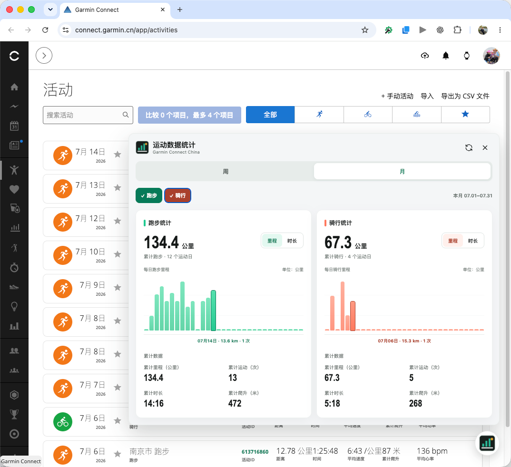

# Garmin 运动统计 Chrome Extension

一个无构建步骤的 Manifest V3 扩展，直接读取已登录的 Garmin Connect China 活动页并生成运动统计。



## 功能

### 1. 运动统计

- 默认展示本月跑步统计，跑步与骑行可多选；双选时统计内容左右并列展示。
- 支持本月和本周（周一至周日）两个统计周期。
- 展示累计里程、活动次数、运动天数、累计时长、累计爬升、平均配速或平均速度。
- 提供每日里程、每日时长柱状图，可切换图表指标并通过键盘查看每日数据。
- 点击浏览器工具栏中的扩展图标，可以打开完整统计弹窗。
- 在 Garmin 活动列表页右下角显示悬浮图标，点击后可直接展开统计面板。
- 手动刷新失败时保留当前数据，并提供未登录、空数据和接口错误状态提示。

### 2. 活动 ID 展示及详情链接

- 在 `https://connect.garmin.cn/app/activities` 活动列表中，将“活动ID”添加到“距离”指标之前。
- 活动 ID 从每条活动原有的详情地址中自动提取，无需额外请求接口。
- 点击活动 ID，会在新的浏览器标签页中打开对应的 Garmin 活动详情：

  ```text
  https://connect.garmin.cn/app/activity/{活动ID}
  ```

- 支持 Garmin 单页应用的路由切换、筛选、排序、分页和虚拟列表行复用；活动列表重新渲染后会自动补充或更新 ID。

## 安装

1. 打开 `chrome://extensions/`。
2. 开启“开发者模式”。
3. 点击“加载已解压的扩展程序”。
4. 选择本目录 `garmin-stats-extension/`。
5. 确保已在 `https://connect.garmin.cn/app/activities` 登录，再点击工具栏中的扩展图标。

从旧版本更新到 `1.2.1` 时，需要在 `chrome://extensions/` 中点击一次扩展的“重新加载”，然后刷新 Garmin 活动页。

扩展只申请 `connect.garmin.cn` 的站点访问权限、`scripting` 和 `storage` 权限。`scripting` 用于读取已打开活动页中的可见活动数据，并在页面数据不足时尝试同源只读请求；浏览器本地只保存已选运动类型与月/周偏好，不保存活动明细或汇总数据。数据不会发送到第三方服务。

## 数据接口

扩展优先解析 Garmin 活动页已经渲染的活动列表。只有页面记录不足以覆盖统计周期时，才回退到 Garmin Connect China 网页认证代理：

```text
https://connect.garmin.cn/app/proxy/activitylist-service/activities/search/activities
```

若 Garmin 调整内部网页接口或活动 JSON 字段，需要同步更新 `background.js` 与 `lib/stats.js` 中的兼容逻辑。

## 测试

```bash
cd garmin-stats-extension
npm test
```

## 文件结构

```text
manifest.json        Manifest V3 配置
background.js        登录态取数、分页与错误处理
popup.html/css/js    扩展弹窗界面与交互
activity-widget.js   Garmin 活动页右下角悬浮统计面板
visual-fixture.js    普通浏览器中的视觉校验模拟数据
lib/garmin-api.js    Garmin China 接口适配与错误分类
lib/garmin-tab.js    已登录 Garmin 标签页同源取数回退
lib/dates.js         本月/本周日期边界
lib/stats.js         活动标准化、聚合与格式化
tests/               Node 内置测试
icons/               扩展图标
```
